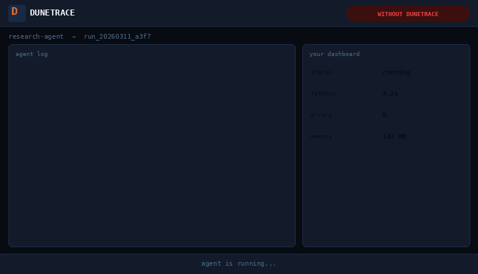
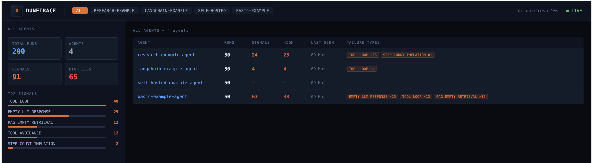
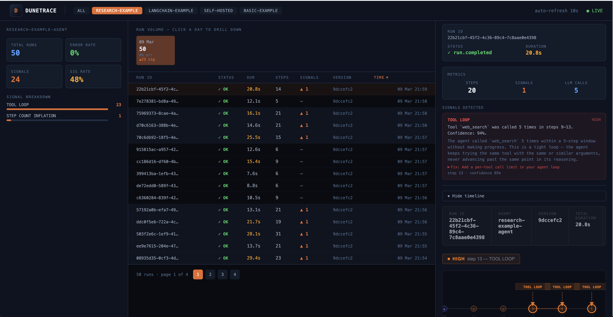

# Dunetrace

[](https://pypi.org/project/dunetrace/)
[](https://pypi.org/project/dunetrace/)
[](https://pepy.tech/projects/dunetrace)
[](LICENSE)

Privacy-safe observability for AI agents at runtime. Detects tool loops, context bloat, prompt injection, and other failure patterns with instant alerts. Zero raw content transmitted. All text is SHA-256 hashed before leaving the agent process.



---

## Quick Start

### 1. Start the backend

```bash
git clone https://github.com/dunetrace/dunetrace
cd dunetrace
cp .env.example .env
docker compose build
docker compose up -d
```
### 2. Install the SDK

```bash
pip install dunetrace
```

### 3. Instrument your agent

```python
from dunetrace import Dunetrace

dt = Dunetrace()  # points to localhost:8001

with dt.run("my-agent", user_input=user_input) as run:
    result = your_agent(user_input)
```

Then open the dashboard: **http://localhost:3000**

| Endpoint | URL |
|---|---|
| Dashboard | http://localhost:3000 |
| API + docs | http://localhost:8002/docs |
| Ingest (SDK) | http://localhost:8001 |


---

## Dashboard





---

## LangChain

```bash
pip install 'dunetrace[langchain]' langchain-openai      # OpenAI
pip install 'dunetrace[langchain]' langchain-anthropic   # Anthropic
pip install 'dunetrace[langchain]' langchain-google-genai  # Gemini
```

```python
from dunetrace import Dunetrace
from dunetrace.integrations.langchain import DunetraceCallbackHandler

dt = Dunetrace()
callback = DunetraceCallbackHandler(dt, agent_id="my-agent")

result = agent.invoke(
    {"messages": [("human", user_input)]},
    config={"callbacks": [callback]},
)
```

## Manual instrumentation

```python
with dt.run("my-agent", user_input=user_input, model="gpt-4o", tools=["search"]) as run:
    run.llm_called("gpt-4o", prompt_tokens=150)
    run.llm_responded(finish_reason="tool_calls", latency_ms=320)

    run.tool_called("search", {"query": user_input})
    run.tool_responded("search", success=True, output_length=512)

    run.llm_called("gpt-4o", prompt_tokens=480)
    run.llm_responded(finish_reason="stop", output_length=120)
    run.final_answer()

dt.shutdown()
```

Use this as a fallback until a native integration exists for your framework.

---

## What it detects

| Detector | What it catches | Severity |
|---|---|---|
| `SLOW_STEP` | Tool call >15s or LLM call >30s | MEDIUM/HIGH |
| `TOOL_AVOIDANCE` | Final answer given without calling available tools | MEDIUM |
| `GOAL_ABANDONMENT` | Tool use stops, then ≥4 consecutive LLM calls with no exit | MEDIUM |
| `RAG_EMPTY_RETRIEVAL` | Retrieval returned 0 results or relevance <0.3, but agent answered | MEDIUM |
| `CONTEXT_BLOAT` | Prompt tokens grow 3× from first to last LLM call | MEDIUM |
| `STEP_COUNT_INFLATION` | Run used >2× the P75 step count for this agent | MEDIUM |
| `FIRST_STEP_FAILURE` | Error or empty output at step ≤2 | MEDIUM |
| `REASONING_STALL` | LLM:tool-call ratio ≥4× — agent reasoning without acting | MEDIUM |
| `TOOL_LOOP` | Same tool called ≥3× in a 5-tool-call window | HIGH |
| `TOOL_THRASHING` | Agent alternates between exactly two tools | HIGH |
| `LLM_TRUNCATION_LOOP` | `finish_reason=length` fires ≥2 times | HIGH |
| `RETRY_STORM` | Same tool fails 3+ times in a row | HIGH |
| `EMPTY_LLM_RESPONSE` | Model returned zero-length output with `finish_reason=stop` | HIGH |
| `CASCADING_TOOL_FAILURE` | 3+ consecutive failures across 2+ distinct tools | HIGH |
| `PROMPT_INJECTION_SIGNAL` | Input matches known injection / jailbreak patterns | CRITICAL |

Thresholds are configurable. See [Tuning detectors](#tuning-detectors).

---

## Examples

**Basic agent** (no framework, simulates tool loops, prompt injection, RAG failures):

```bash
cd packages/sdk-py
pip install dunetrace
python examples/basic_agent.py
```

**LangChain agent** (real OpenAI calls, auto-instrumented via callback):

```bash
cd packages/sdk-py
pip install 'dunetrace[langchain]' langchain-openai
OPENAI_API_KEY=sk-... python examples/langchain_agent.py

# Force a tool-loop scenario:
OPENAI_API_KEY=sk-... SCENARIO=tool_loop python examples/langchain_agent.py
```

Both examples send events to `http://localhost:8001` by default. Override with `DUNETRACE_ENDPOINT=http://your-host:8001`.

---

## Slack alerts

Add to your `.env`:

```bash
SLACK_WEBHOOK_URL=https://hooks.slack.com/services/xxx/yyy/zzz
SLACK_CHANNEL=#agent-alerts
SLACK_MIN_SEVERITY=HIGH   # LOW | MEDIUM | HIGH | CRITICAL
```

Get a webhook URL from [api.slack.com/messaging/webhooks](https://api.slack.com/messaging/webhooks). Restart the alerts worker to pick up the change:

```bash
docker compose restart alerts
```

**Generic webhook** (PagerDuty, Linear, custom endpoints):

```bash
WEBHOOK_URL=https://your-endpoint.example.com/alerts
WEBHOOK_SECRET=your-hmac-secret   # optional — enables HMAC-SHA256 signature header
```

Both destinations can be active at the same time. Leave a variable blank to disable.

**Shadow mode:** signals are stored with a `shadow` flag. The alerts worker only delivers signals where `shadow = false`. All 15 built-in detectors are live by default. Custom detectors start in shadow mode until you add them to `LIVE_DETECTORS` in `services/detector/detector_svc/db.py`:

```python
LIVE_DETECTORS: set[str] = {
    "TOOL_LOOP",
    "YOUR_NEW_DETECTOR",   # add here once precision > 80%
    ...
}
```

---

## Tuning detectors

Edit `detectors.yml` in the repo root. No code change or rebuild needed:

```yaml
default:
  tool_loop:
    threshold: 2        # lower = catch loops sooner
  context_bloat:
    growth_factor: 4.0  # raise for agents that intentionally accumulate context

web-research:
  tool_loop:
    threshold: 5        # search agents legitimately repeat queries across pages
```

Named sections inherit from `default` and override only what you specify. Restart the detector to apply:

```bash
docker compose restart detector
```

---

## Grafana / Loki

```python
dt = Dunetrace(emit_as_json=True)
```

Writes every event to stdout as a Loki-compatible NDJSON line. Each line includes `ts`, `level`, `logger`, `event_type`, `agent_id`, `run_id`, `step_index`, and `payload`. Works alongside HTTP ingest, both can be active at the same time.

Minimal Promtail pipeline stage:

```yaml
pipeline_stages:
  - json:
      expressions: {ts: ts, event_type: event_type, agent_id: agent_id}
  - timestamp:
      source: ts
      format: RFC3339Nano
  - labels:
      agent_id:
      event_type:
```

---

## Architecture

```
Agent Code
  └─► Dunetrace SDK              (instrument runs, emit hashed events)
        ├─► Ingest API           (POST /v1/ingest -> Postgres)
        │     └─► Detector       (poll -> reconstruct RunState -> run detectors)
        │           └─► Alerts   (poll -> explain -> Slack / webhook)
        │                 └─► Customer API  (query runs, signals, explanations)
        ├─► stdout NDJSON        (emit_as_json=True -> Loki / Grafana Alloy)
        └─► OTel spans           (otel_exporter=… -> Tempo / Honeycomb / Datadog)
```

| Service | Port | Purpose |
|---|---|---|
| `services/ingest` | 8001 | Accept SDK events |
| `services/detector` | — | Detection worker |
| `services/explainer` | — | Deterministic explanation library |
| `services/alerts` | — | Slack / webhook delivery |
| `services/api` | 8002 | REST API |

---

## Running tests

```bash
# Explainer
PYTHONPATH=packages/sdk-py:services/explainer pytest services/explainer/tests/ -v

# Detector worker
PYTHONPATH=packages/sdk-py:services/detector pytest services/detector/tests/ -v

# Alerts worker
PYTHONPATH=packages/sdk-py:services/explainer:services/alerts pytest services/alerts/tests/ -v

# API
PYTHONPATH=packages/sdk-py:services/explainer:services/api pytest services/api/tests/ -v
```

---

## Requirements

- Python 3.11+
- Docker + Docker Compose
- PostgreSQL 16+ (included in Docker Compose)

## Contributing

1. Fork the repo and create a branch
2. Make your changes and add tests
3. Run the relevant test suite (see [Running tests](#running-tests))
4. Open a pull request with a clear description of what and why

For larger changes (new detectors, architecture changes), open an issue first.

## Star us (⭐)

If Dunetrace looks useful, a GitHub star helps others find the project.

## Contact

[dunetrace@gmail.com](mailto:dunetrace@gmail.com)

## License

[Apache 2.0](LICENSE)
