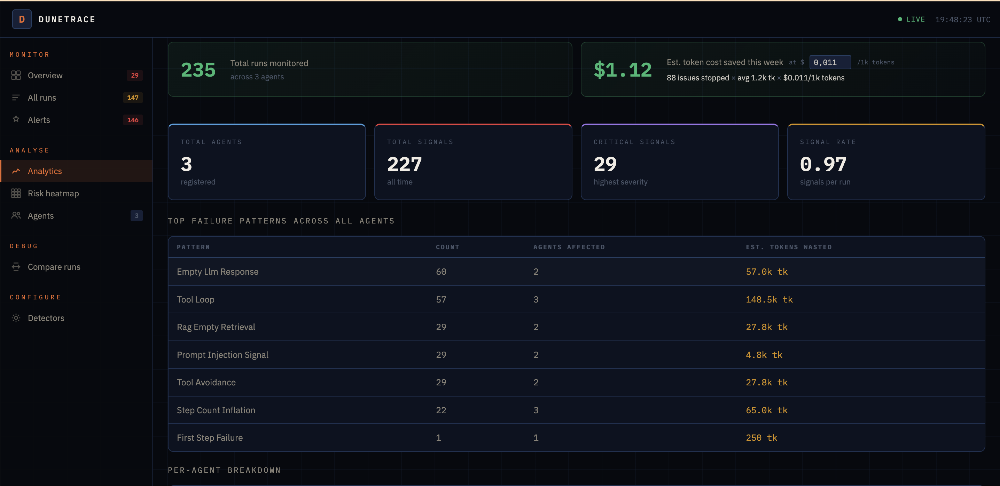
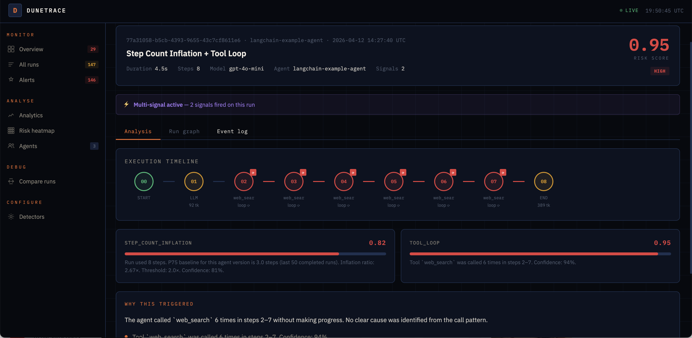

# Dunetrace


### Runtime observability for AI agents

**Detect structural failures automatically. Alert before your users do.**

[](https://pypi.org/project/dunetrace/)
[](https://pypi.org/project/dunetrace/)
[](https://pepy.tech/projects/dunetrace)
[](https://github.com/dunetrace/dunetrace)
[](LICENSE)
[](https://discord.gg/NEtdVukx)

---

## The problem

AI agents fail in ways that traditional monitoring can't see.

Your API returns 200. Your logs show no exceptions. But the agent called the same tool 12 times in a row, burned $X in tokens, and gave the user a wrong answer or no answer at all.

These are **structural failures** — tool loops, context bloat, reasoning stalls. They happen inside the agent's decision loop, between the lines your existing monitoring covers. By the time a user reports a problem, the damage is already done.

LangSmith/Langfuse answer "what happened?" after you already know something broke. OpenLLMetry gives you OTel spans across 40+ frameworks — great coverage, no behavioral detection.

Dunetrace answers a different question: **"is something breaking right now?"**

It watches the structural pattern of every run and fires a Slack alert while the run is still in progress or within 15 seconds of completion.

---

## Quick Start

### 1. Start the backend

```bash
git clone https://github.com/dunetrace/dunetrace
cd dunetrace && cp .env.example .env && docker compose build && docker compose up -d
```

### 2. Install the SDK

```bash
pip install dunetrace                    # any framework
pip install 'dunetrace[langchain]'      # LangChain / LangGraph
```

### 3. Instrument your agent

```python
from dunetrace import Dunetrace

dt = Dunetrace(api_key="dt_live_...")
dt.init(agent_id="my-agent")   # patches openai, anthropic, httpx, requests globally

@dt.agent()
def run_agent(query: str) -> str:
    ...                        # LLM + HTTP calls tracked automatically
```

Then open the dashboard: **[http://localhost:3000](http://localhost:3000)**

| Endpoint     | URL                                                      |
| ------------ | -------------------------------------------------------- |
| Dashboard    | [http://localhost:3000](http://localhost:3000)           |
| API + docs   | [http://localhost:8002/docs](http://localhost:8002/docs) |
| Ingest (SDK) | [http://localhost:8001](http://localhost:8001)           |

→ [Full integration options](docs/integrations.md) — LangChain, FastAPI, Flask, OpenLLMetry, manual

---

## What it detects

15 structural detectors run automatically against every completed run.

| Detector | Severity |
|---|---|
| `TOOL_LOOP` — same tool called ≥3× in a 5-step window | HIGH |
| `RETRY_STORM` — same tool fails 3+ times in a row | HIGH |
| `TOOL_THRASHING` — agent alternates between exactly two tools | HIGH |
| `LLM_TRUNCATION_LOOP` — `finish_reason=length` fires ≥2 times | HIGH |
| `CASCADING_TOOL_FAILURE` — 3+ consecutive failures across 2+ tools | HIGH |
| `EMPTY_LLM_RESPONSE` — zero-length output with `finish_reason=stop` | HIGH |
| `CONTEXT_BLOAT` — prompt tokens grow 3× from first to last LLM call | MEDIUM |
| `REASONING_STALL` — LLM:tool ratio ≥4× with no progress | MEDIUM |
| `GOAL_ABANDONMENT` — tool use stops, then ≥4 consecutive LLM calls | MEDIUM |
| `SLOW_STEP` — tool call >15s or LLM call >30s | MEDIUM/HIGH |
| `RAG_EMPTY_RETRIEVAL` — retrieval returned 0 results but agent answered | MEDIUM |
| `STEP_COUNT_INFLATION` — run used >2× the P75 step count for this agent | MEDIUM |
| `FIRST_STEP_FAILURE` — error or empty output at step ≤2 | MEDIUM |
| `TOOL_AVOIDANCE` — final answer given without calling available tools | MEDIUM |
| `PROMPT_INJECTION_SIGNAL` — input matches known injection patterns | CRITICAL |

All thresholds are configurable without code changes. → [docs/detectors.md](docs/detectors.md)

---

## Dashboard





Live single-page app at **[http://localhost:3000](http://localhost:3000)**. Auto-refreshes every 15s. No build step.

8 pages: Overview · All Runs · Alerts · Analytics · Risk Heatmap · Agents · Compare Runs · Detectors

→ [docs/dashboard.md](docs/dashboard.md) — page descriptions, run detail tabs, token waste estimates, shadow signals, data sources

---

## Privacy

No raw content ever leaves your agent process. Every prompt, tool argument, and model output is SHA-256 hashed before transmission. The ingest API receives hashes, token counts, latency values, and call sequences — never plaintext.

→ [docs/architecture.md](docs/architecture.md) for the full privacy model and DB schema.

---

## Alerts

Slack and generic webhook (PagerDuty, Linear, custom).


→ [docs/alerts.md](docs/alerts.md)

---

## Architecture

```
Agent Code
  └─► Dunetrace SDK        (hashes content → ingest events + OTel spans)
        └─► Ingest API      (POST /v1/ingest → Postgres)
                ├─► Detector       (poll → RunState → 15 detectors → signals)
                ├─► Alerts         (poll → explain → Slack / webhook)
                └─► Customer API   (runs, signals, explanations → dashboard)
        ├─► stdout NDJSON   (emit_as_json=True → Loki / Grafana Alloy)
        └─► OTel exporter   (otel_exporter=… → Tempo / Honeycomb / Datadog)
```

→ [docs/architecture.md](docs/architecture.md) — service internals, DB schema, OTel exporter, performance

---

## Integrations

- [LangChain / LangGraph](docs/integrations.md#langchain--langgraph)
- [FastAPI / Flask / ASGI / WSGI](docs/integrations.md)
- [Grafana / Loki](docs/integrations.md#grafana--loki)
- [OpenTelemetry / OpenLLMetry](docs/integrations.md#opentelemetry)

---

## Running tests

```bash
# SDK only (no Docker required)
cd packages/sdk-py && python -m unittest discover -s tests -v

# Full suite (requires Docker)
PYTHONPATH=packages/sdk-py:services/explainer:services/alerts:services/detector:services/api:services/ingest \
  python -m pytest packages/sdk-py/tests/ services/explainer/tests/ services/detector/tests/ \
    services/alerts/tests/ services/api/tests/ services/ingest/tests/ \
  --asyncio-mode=auto -v
```

---

## Requirements

- Python 3.11+
- Docker + Docker Compose
- PostgreSQL 16+ (included in Docker Compose)

## Contributing

1. Fork the repo and create a branch
2. Make your changes and add tests
3. Run the test suite
4. Open a pull request with a clear description of what and why

For larger changes (new detectors, architecture changes), open an issue first.

## Star us ⭐

If Dunetrace looks useful, a GitHub star helps others find the project.

[](https://star-history.com/#dunetrace/dunetrace&Date)

## Contact

[dunetrace@gmail.com](mailto:dunetrace@gmail.com)

## License

[Apache 2.0](LICENSE)
