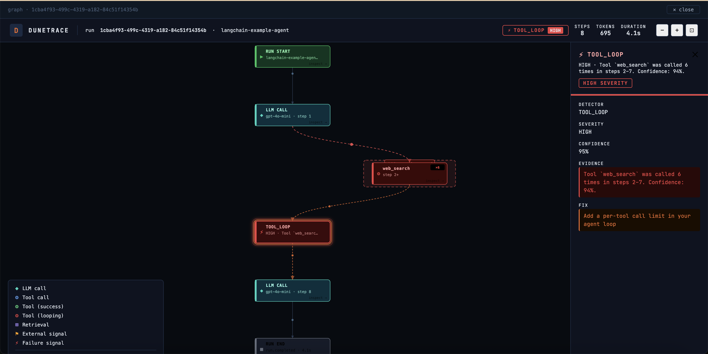

# Dunetrace


### Runtime observability for AI agents

**Detect structural failures automatically. Alert before your users do.**

[](https://pypi.org/project/dunetrace/)
[](https://pypi.org/project/dunetrace/)
[](https://pepy.tech/projects/dunetrace)
[](https://github.com/dunetrace/dunetrace)
[](LICENSE)
[](https://discord.gg/NEtdVukx)

---

## The problem

AI agents fail in ways that traditional monitoring can't see.

Your API returns 200. Your logs show no exceptions. But the agent called the same tool 12 times in a row, burned $X in tokens, and gave the user a wrong answer or no answer at all.

These are structural failures: tool loops, context bloat, reasoning stalls etc. They happen inside the agent's decision loop, between the lines your existing monitoring covers. By the time a user reports a problem, the damage is already done.

**The result:** you're flying blind. You find out about agent failures from users, not dashboards.

## Why existing tools don't catch this

LangSmith/Langfuse are excellent but they answer "what happened?" after you already know something broke. You open the trace, investigate, find the problem.

Dunetrace answers a different question: **"is something breaking right now?"**

It watches the structural pattern of every run automatically and fires a Slack alert while the run is still in progress or within 15 seconds of completion.

## The solution

Dunetrace instruments the agent loop itself. Every tool call, LLM call, and retrieval is observed at runtime. A set of structural detectors runs against each completed run, flags failure patterns the moment they occur, and sends a Slack alert in <15s with a plain-English explanation and a concrete fix.

## Privacy architecture

No raw content ever leaves your agent process.

Every prompt, tool argument, and model output is SHA-256 hashed before transmission. The ingest API receives hashes, token counts, latency values, and call sequences - never plaintext.

The database has no raw content column. This matters for enterprise teams with data governance requirements (GDPR, HIPAA, internal data classification).

```json
// What the SDK actually transmits
{
  "event":      "tool_called",
  "tool_name":  "web_search",
  "args_hash":  "a3f7c9d2...",    // SHA(args), not args
  "step":       3,
  "timestamp":  1741772467.312
}
```

---

## Quick Start

### 1. Start the backend

```bash
git clone https://github.com/dunetrace/dunetrace
cd dunetrace
cp .env.example .env
docker compose build
docker compose up -d
```

### 2. Install the SDK

```bash
pip install dunetrace                    # any framework
pip install 'dunetrace[langchain]'      # LangChain / LangGraph
```

### 3. Instrument your agent

**LangChain / LangGraph**: add a callback handler (auto-captures all LLM calls, tool calls, and retrievals):

```python
from dunetrace import Dunetrace
from dunetrace.integrations.langchain import DunetraceCallbackHandler

dt = Dunetrace()
callback = DunetraceCallbackHandler(dt, agent_id="my-agent")

result = agent.invoke(input, config={"callbacks": [callback]})
dt.shutdown()
```

**Other frameworks**: wrap the run and emit events manually:

```python
from dunetrace import Dunetrace

dt = Dunetrace()
with dt.run("my-agent", user_input=user_input, model="gpt-4o", tools=["search"]) as run:
    run.llm_called(...)
    run.tool_called(...)
    run.final_answer()
```

→ Full setup and examples: [docs/integrations.md](docs/integrations.md)

Then open the dashboard: **[http://localhost:3000](http://localhost:3000)**


| Endpoint     | URL                                                      |
| ------------ | -------------------------------------------------------- |
| Dashboard    | [http://localhost:3000](http://localhost:3000)           |
| API + docs   | [http://localhost:8002/docs](http://localhost:8002/docs) |
| Ingest (SDK) | [http://localhost:8001](http://localhost:8001)           |


---

## Dashboard




---

## What it detects


| Detector                  | What it catches                                                    | Severity    |
| ------------------------- | ------------------------------------------------------------------ | ----------- |
| `TOOL_LOOP`               | Same tool called ≥3× in a 5-tool-call window                       | HIGH        |
| `TOOL_THRASHING`          | Agent alternates between exactly two tools                         | HIGH        |
| `LLM_TRUNCATION_LOOP`     | `finish_reason=length` fires ≥2 times                              | HIGH        |
| `RETRY_STORM`             | Same tool fails 3+ times in a row                                  | HIGH        |
| `EMPTY_LLM_RESPONSE`      | Model returned zero-length output with `finish_reason=stop`        | HIGH        |
| `CASCADING_TOOL_FAILURE`  | 3+ consecutive failures across 2+ distinct tools                   | HIGH        |
| `SLOW_STEP`               | Tool call >15s or LLM call >30s                                    | MEDIUM/HIGH |
| `TOOL_AVOIDANCE`          | Final answer given without calling available tools                 | MEDIUM      |
| `GOAL_ABANDONMENT`        | Tool use stops, then ≥4 consecutive LLM calls with no exit         | MEDIUM      |
| `RAG_EMPTY_RETRIEVAL`     | Retrieval returned 0 results or relevance <0.3, but agent answered | MEDIUM      |
| `CONTEXT_BLOAT`           | Prompt tokens grow 3× from first to last LLM call                  | MEDIUM      |
| `STEP_COUNT_INFLATION`    | Run used >2× the P75 step count for this agent                     | MEDIUM      |
| `FIRST_STEP_FAILURE`      | Error or empty output at step ≤2                                   | MEDIUM      |
| `REASONING_STALL`         | LLM:tool-call ratio ≥4× — agent reasoning without acting           | MEDIUM      |
| `PROMPT_INJECTION_SIGNAL` | Input matches known injection / jailbreak patterns                 | CRITICAL    |


Thresholds are configurable. → [docs/detectors.md](docs/detectors.md)

---

## Integrations

- [LangChain / LangGraph](docs/integrations.md#langchain--langgraph)
- [Manual instrumentation](docs/integrations.md#manual-instrumentation)
- [Grafana / Loki](docs/integrations.md#grafana--loki)
- [OpenTelemetry](docs/integrations.md#opentelemetry)

---

## Alerts

Slack and generic webhook (PagerDuty, Linear, custom). → [docs/alerts.md](docs/alerts.md)


---

## Architecture

```
Agent Code
  └─► Dunetrace SDK              (hashes content → Dunetrace event schema)
        │                        (mirrors to OTel span schema, content stripped)
        └─► Ingest API           (POST /v1/ingest -> Postgres)
                    ├─► Detector       (poll -> reconstruct RunState -> run detectors -> write signals)
                    ├─► Alerts         (poll -> explain -> Slack / webhook)
                    └─► Customer API   (query runs, signals, explanations)
        ├─► stdout NDJSON        (emit_as_json=True -> Loki / Grafana Alloy)
        └─► OTel exporter        (otel_exporter=… -> Tempo / Honeycomb / Datadog)
```

> OTel spans are derived from the same instrumentation as Dunetrace events. Content fields are SHA-256 hashed before either path emits. The OTel exporter runs a local detector pass (SDK default thresholds) and annotates the root span — independent of the server-side detector, which uses `detectors.yml` and is the source of truth for alerts and the dashboard. → [docs/architecture.md](docs/architecture.md#otel-span-exporter)

→ [docs/architecture.md](docs/architecture.md) for service internals, DB schema, and performance characteristics.

---

## Running tests

```bash
PYTHONPATH=packages/sdk-py:services/explainer:services/alerts:services/detector:services/api:services/ingest \
  python -m pytest packages/sdk-py/tests/ services/explainer/tests/ services/detector/tests/ \
    services/alerts/tests/ services/api/tests/ services/ingest/tests/ \
  --asyncio-mode=auto -v
```

---

## Requirements

- Python 3.11+
- Docker + Docker Compose
- PostgreSQL 16+ (included in Docker Compose)

## Contributing

1. Fork the repo and create a branch
2. Make your changes and add tests
3. Run the test suite (see above)
4. Open a pull request with a clear description of what and why

For larger changes (new detectors, architecture changes), open an issue first.

## Star us (⭐)

If Dunetrace looks useful, a GitHub star helps others find the project.

## Contact

[dunetrace@gmail.com](mailto:dunetrace@gmail.com)

## License

[Apache 2.0](LICENSE)