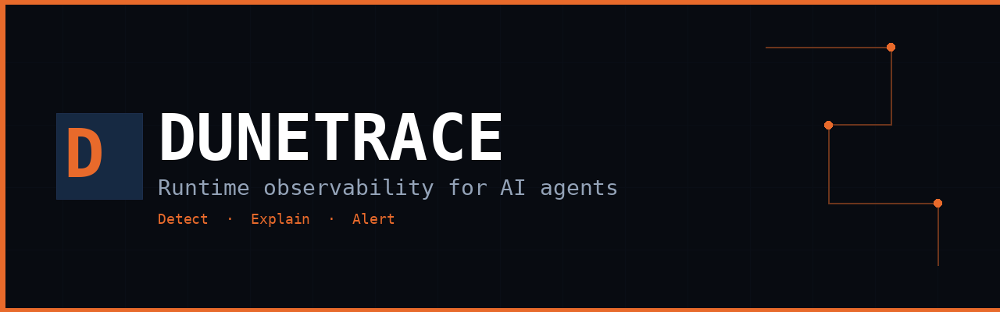
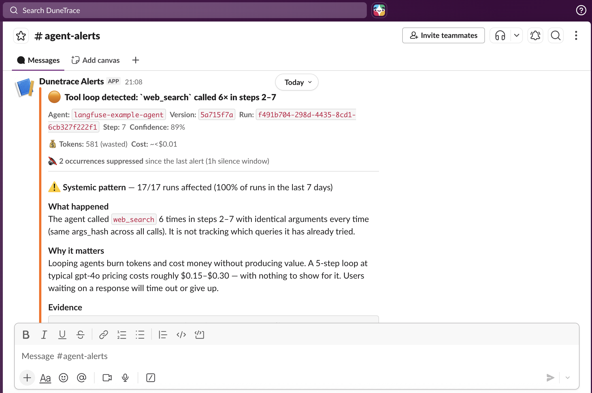
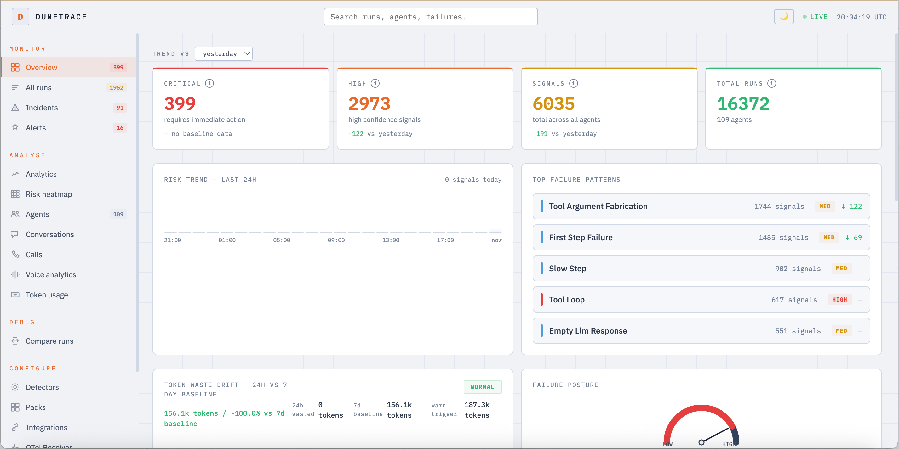

# Dunetrace



**Runtime reliability for AI agents. Structural and semantic detection, runtime prevention, native root cause, and one-click fixes.**

[](https://pypi.org/project/dunetrace/)
[](https://pypi.org/project/dunetrace/)
[](https://pepy.tech/projects/dunetrace)
[](https://www.npmjs.com/package/dunetrace)
[](https://github.com/dunetrace/dunetrace/actions/workflows/ci.yml)
[](https://github.com/dunetrace/dunetrace/actions/workflows/codeql.yml)
[](https://github.com/dunetrace/dunetrace)
[](LICENSE)
[](https://discord.gg/yxFjATwHW4)



---

## Star us ⭐

**If Dunetrace helps you, consider giving it a ⭐ on top right, it helps others find the project.**

---

## The problem

AI agents fail silently:

- ✓ API returns 200 &nbsp; ✓ Logs are clean
- ✗ Agent called the same tool 12 times, burned $10, and gave the user a wrong answer

Tracers answer "what happened?" — after you already know it broke.
Dunetrace answers **"is something breaking right now?"** and fires an alert in 15 seconds,
using zero-LLM structural checks that run in-path with sub-500μs per-hook overhead.¹

---

## Five pillars, one platform

Dunetrace covers the full agent reliability lifecycle, not just one slice of it:

| | Pillar | What it does |
|---|---|---|
| 1 | **Sessions & Events** | Every run, every tool call, every LLM exchange — the raw data everything else is built on |
| 2 | **Structural Detection** | 32 zero-LLM detectors (29 of them in-path, sub-500μs per hook ¹) — the always-on first line |
| 3 | **Semantic Evaluation** | LLM-based judgment (hallucination, task completion, cross-turn frustration) — post-hoc, sampling-based, opt-in → [docs/semantic-evaluation.md](docs/semantic-evaluation.md) |
| 4 | **Runtime Prevention** | Policies that stop, redirect, or downgrade a run *while it's happening* — the differentiator no tracer offers → [docs/policies.md](docs/policies.md) |
| 5 | **Root Cause & Fix** | Native root-cause analysis, auto-applied policy fixes, or a one-click draft PR → [Diagnose & fix](#diagnose--fix) |

¹ Per instrumentation hook (`tool_called`, `llm_responded`, …) — benchmarked in
`packages/sdk-py/tests/test_benchmark.py`. The one exception is the prompt-injection
scan at run start, which is bounded rather than sub-millisecond: it scans up to 32K
characters of input, ~10ms worst case against an LLM call of 500ms+. See
[docs/detectors.md](docs/detectors.md) footnote 2.

**Where tracers fit in:** if you already run Langfuse, LangSmith, or Braintrust,
Dunetrace pulls their evaluation results in alongside its own (pillar 3) rather
than asking you to switch — see [docs/integrations/external-evaluation.md](docs/integrations/external-evaluation.md).
What no tracer does is pillar 4: none of them can stop a run mid-flight, because
none of them run in-path.

| | Dunetrace | A tracer (Langfuse / LangSmith / etc.) |
|---|---|---|
| **When it fires** | Within 15s of run completion (structural); can also stop a run *while it's happening* (policies) | You query it after you notice a problem |
| **What it watches** | Structural patterns (always) + LLM-based semantic judgment (opt-in) | Raw trace data |
| **Alert channel** | Slack / webhook / Dashboard | Dashboard only |
| **Fix path** | Auto-apply a policy, one-click draft PR, or push to a connected prompt store | Manual |
| **Your existing tracer** | Pull its evaluations in, use alongside Dunetrace's own | — |

---

## Quick Start

See the [examples index](examples/README.md) for ready‑to‑run examples.

**1. Start the backend**
```bash
git clone https://github.com/dunetrace/dunetrace
cd dunetrace && cp .env.example .env
docker compose -f docker-compose.ghcr.yml up -d
pip install -r requirements.txt
```

**2. Install the SDK**
```bash
pip install dunetrace                       # Python
npm install dunetrace                       # Node.js / TypeScript
```

**3. Instrument your agent**

**Python**
```python
from dunetrace import Dunetrace
import openai

dt = Dunetrace()
dt.init(agent_id="support-agent")   # auto-instruments installed clients (OpenAI, Anthropic, Mistral, Bedrock, LangChain, CrewAI, httpx, requests)

@dt.agent("support-agent", model="gpt-4o")
def my_agent(question: str) -> str:
    resp = openai.chat.completions.create(
        model="gpt-4o",
        messages=[{"role": "user", "content": question}],
    )
    return resp.choices[0].message.content   # LLM + tool calls tracked automatically, no manual hooks
```

**TypeScript / Node.js**
```typescript
import { Dunetrace, autoInstrument } from "dunetrace";
import OpenAI from "openai";

const dt = new Dunetrace();
autoInstrument({ openai: OpenAI });   // patches OpenAI + outbound fetch; add `anthropic: Anthropic` or `mistral: Mistral` if you use them

const openai = new OpenAI();          // constructed after the patch — still tracked

await dt.run("support-agent", { model: "gpt-4o" }, async (run) => {
  await openai.chat.completions.create({ model: "gpt-4o", messages });
  run.finalAnswer();                  // LLM + tool calls tracked automatically, streaming included
});
```

To instrument a single client instead, use `dt.wrapOpenAI(new OpenAI())`. See [docs/integrate-typescript-agent.md](docs/integrate-typescript-agent.md#auto-instrumentation).

**Try the built-in failure scenarios**

Python — run from `packages/sdk-py`:
```bash
cd packages/sdk-py

python examples/basic_agent.py                          # No LLM calls
SCENARIO=tool_loop python examples/langchain_agent.py   # TOOL_LOOP via LangChain
SCENARIO=failures python examples/decorator_agent.py    # TOOL_LOOP, RETRY_STORM, RAG_EMPTY_RETRIEVAL
```

TypeScript: run from `packages/sdk-ts`. Drives the Vercel AI SDK against a local Ollama, so no API key is needed:
```bash
cd packages/sdk-ts
npm install && ollama pull llama3.2

npm run example:vercel-ai                               # Happy path
npm run example:vercel-ai:loop                          # TOOL_LOOP, then prints the root cause and fix
```

The `:loop` variant provokes a tool loop, polls until the detector picks it up, then calls `POST /v1/signals/{id}/explain` — so it exercises the full detect → explain path end to end. That explain call spends one LLM call on whatever provider the *stack* is configured with; the agent's own calls are free.

Open the dashboard: **[http://localhost:3000](http://localhost:3000)**

---

## Detectors

32 detectors run on every completed run — no configuration, no LLM. A few of the main ones:

| Signal | What it catches |
|---|---|
| `TOOL_LOOP` | Same tool called repeatedly with identical args |
| `RETRY_STORM` | Tool failing, agent retrying it repeatedly |
| `COST_SPIKE` | Total token consumption unusually high vs per-agent baseline |
| `PROMPT_INJECTION_SIGNAL` | Input matched adversarial injection patterns |
| `MEMORY_POISONING` | An injection directive was written into the agent's own memory, re-steering it when read back |
| `DELEGATION_LOOP` | Agents delegate to each other in a cycle that never converges |
| `RUNAWAY_ITERATION` | Step or cost ceiling crossed with no completion signal |
| `SILENT_TRUNCATION` | A response was truncated and the agent used it without retrying |
| `MODEL_FALLBACK_DRIFT` | The run silently switched to a weaker model (e.g. under rate limiting) |

Each alert includes: what fired, why it matters, a concrete fix, and a rate context line (first occurrence / recurring / systemic).

→ [docs/detectors.md](docs/detectors.md) for the full list of 32 detectors

**Multi-agent systems** — instrument each agent as its own `dt.run()` and Dunetrace auto-links them into a delegation graph (`parent_run_id` is threaded automatically for nested runs). Two detectors read that graph: `DELEGATION_LOOP` (agents cycling without converging) and `HANDOFF_CONTEXT_LOSS` (a handoff dropping the parent's context). → [docs/multi-agent.md](docs/multi-agent.md)

**Agent memory** — instrument what an agent writes to and reads from its own memory (`run.memory_written()` / `memory_read()`, or automatically for LangGraph/CrewAI memory via `dt.auto_instrument()`), and `MEMORY_POISONING` flags adversarial content persisted into it. → [docs/memory.md](docs/memory.md)

**Custom detectors** — write a detector in plain English. Dunetrace translates it to a structured condition set, runs it in shadow mode against real traffic, and lets you review the fire rate before any alert fires. In the dashboard: **Config → Custom detectors → Add detector**.

**Detector packs** — opt-in detector bundles for a specific class of agent, activated per org. The **voice pack** adds 9 detectors for real-time voice agents (`dt.enable_pack("voice")`). Built-in detectors always run; packs only add to them and start in shadow mode.

→ [detector packs](docs/detector-packs/index.md) · [voice pack](docs/detector-packs/voice.md) · [wiring a voice framework](docs/integrations/voice-frameworks.md)

---

## Semantic evaluation

For failure modes no structural check can catch — did the agent hallucinate,
did it finish the task, did it solve the wrong task, is the user going in
circles. Post-hoc (never in your agent's request path), sampling-based,
disabled by default. Ships seven [DeepEval](https://github.com/confident-ai/deepeval)-backed
evaluators — four run-level (hallucination, task completion, task-understanding
failure, off-topic drift) and three conversation-level (user frustration,
confusion loops, sycophancy) — plus false-positive management (confidence
floors, grouping, feedback loop, second-opinion for high-stakes findings). Each
calibrated before ship (see `scripts/calibration/`).

```bash
SEMANTIC_WORKER_ENABLED=true
```

The semantic worker runs as its own container. It's in both compose files and
off by default — set the flag in `.env` and bring the stack back up. Same for
the external-evaluation and ElevenLabs workers.

→ [docs/semantic-evaluation.md](docs/semantic-evaluation.md)

---

## Dashboard



Live at **[http://localhost:3000](http://localhost:3000)**. Auto-refreshes every 15s.

→ [docs/dashboard.md](docs/dashboard.md)

---

## Alerts

Slack and generic webhook (PagerDuty, Linear, custom).

```bash
SLACK_WEBHOOK_URL=https://hooks.slack.com/services/...
SLACK_MIN_SEVERITY=LOW   # LOW | MEDIUM | HIGH | CRITICAL
```

A weekly digest (Monday 9am UTC) summarises top failure types and systemic patterns. Enable with `DIGEST_ENABLED=true`.

→ [docs/alerts.md](docs/alerts.md)

---

## Diagnose & fix

Root-cause analysis is native — no third-party tracer required. Click **Explain +** on any alert and Dunetrace analyzes the run's own stored events and returns a specific cause and fix. Every fix is one of two kinds:

- **Policy fixes** (tool loops, retry storms, runaway step counts) → Dunetrace applies a runtime guardrail directly, no code change needed
- **Prompt / code fixes** → a diff you copy in, or a one-click draft PR on GitHub for code/infra changes

Fix effectiveness is tracked automatically.

---

## Policies

Runtime guardrails that fire mid-run — before a failure propagates.

```python
dt.add_policy(
    name="cap tool calls",
    condition={"trigger": "tool_call_count", "operator": "gt", "value": 5},
    action={"type": "stop"},
)
dt.add_policy(
    name="cost cap",
    condition={"trigger": "cost_usd", "operator": "gt", "value": 0.50},
    action={"type": "switch_model", "params": {"model": "gpt-4o-mini"}},
)
```

Policies can also be created in the dashboard and fetched automatically by the SDK (60s TTL).

**Human-in-the-loop approvals** — gate a risky tool (wiring money, deleting data) behind human approval. A `require_approval` policy blocks the tool call until someone approves in Slack or the dashboard, or it times out (fail-closed: a timeout blocks the tool). No agent code changes — the gate fires on the existing tool-call hook.

```python
dt.add_policy(
    name="approve-wires",
    condition={"trigger": "before_tool_call", "operator": "eq", "value": "wire_money"},
    action={"type": "require_approval", "params": {"timeout_s": 300}},
)
```

→ [docs/policies.md](docs/policies.md) · [docs/approvals.md](docs/approvals.md)

---

## MCP server

Query agent signals directly from Claude Code, Cursor, or Codex — without leaving your editor.

```bash
pip install dunetrace-mcp
```

<details>
<summary>31 tools for signals, runs, policies, and custom detectors. Ask your editor things like "what failed in the last 24 hours?" A representative 10:</summary>

| Tool | What you can ask |
|---|---|
| `list_agents` | "Which agents are monitored and how healthy are they?" |
| `get_agent_signals` | "What failures did my agent have today?" |
| `get_agent_health` | "Show me the health score breakdown for my agent." |
| `get_signal_detail` | "Show me signal #42 with full evidence and fix code." |
| `get_agent_patterns` | "Is this failure systemic or a one-off?" |
| `get_run_detail` | "Walk me through run abc123 step by step." |
| `get_agent_runs` | "List recent runs for my agent with their status." |
| `search_signals` | "Show me all CRITICAL signals in the last 24 hours." |
| `summarize_agent` | "Give me a one-shot diagnosis of my agent." |
| `get_agent_token_stats` | "How much is my agent wasting on failed runs?" |

</details>

**Claude Code**: registered automatically in `~/.claude.json` after `pip install dunetrace-mcp`. Restart Claude Code to load.

**Cursor**: add `.cursor/mcp.json` to your project root:

```json
{
  "mcpServers": {
    "dunetrace": {
      "command": "dunetrace-mcp",
      "env": {
        "DUNETRACE_API_URL": "http://localhost:8002",
        "DUNETRACE_API_KEY": "dt_dev_test"
      }
    }
  }
}
```

→ [docs/mcp-server.md](docs/mcp-server.md)

---

## Architecture

```
Agent Code
  └─► Dunetrace SDK        (raw content → ingest events)
        └─► Ingest API      (POST /v1/ingest → Postgres)
                ├─► Detector          (poll → 32 detectors → signals)
                ├─► Semantic Worker   (optional — poll → DeepEval → signals)
                ├─► Integrations      (optional — pull Langfuse/LangSmith/Braintrust)
                ├─► Alerts            (poll → explain → Slack / webhook)
                └─► Customer API      (runs, signals, explanations → dashboard)
```

→ [docs/architecture.md](docs/architecture.md) for the full service breakdown
· [operations guide](docs/operations.md) (retention, rate limiting, quotas)

---

## Integrations

**Model providers** — OpenAI, Anthropic, Mistral and AWS Bedrock, auto-instrumented with no call-site changes.
- [Auto-instrumentation (what's patched, streaming, agent_id resolution)](docs/integrations/auto-instrumentation.md)
- [Mistral (hyperscaler-hosted clients, EU-resident evaluation)](docs/integrations/mistral.md)

**Evaluation & tracing**
- [OpenTelemetry export (Datadog, Grafana, Honeycomb, Signoz, any OTLP backend)](docs/integrations/opentelemetry.md)
- [OpenTelemetry ingestion (send your existing OTel traces to Dunetrace: OpenLIT, Traceloop, OTel contrib)](docs/integrations/otel-ingestion.md)
- [External evaluation (Langfuse, LangSmith, Braintrust, generic push)](docs/integrations/external-evaluation.md)
- [Semantic evaluation (Dunetrace's own DeepEval-backed layer)](docs/semantic-evaluation.md)

**Fix & workflow**
- [GitHub App (automated draft PRs)](docs/integrations/github-app.md)
- [Slack & Linear alerts](docs/alerts.md)
- [Coding agents — Claude Code, Cursor, Codex (MCP)](docs/integrations/coding-agents.md)

**Voice**
- [ElevenLabs (correlate TTS cost and voice choices with agent behavior)](docs/integrations/elevenlabs.md)
- [Wiring a voice framework](docs/integrations/voice-frameworks.md)
- [Voice metrics (call-level view of a voice agent)](docs/voice-metrics.md)
- [Voice detector pack (9 detectors)](docs/detector-packs/voice.md)

<details>
<summary>Agent frameworks: LangChain, CrewAI, AutoGen, Haystack, LlamaIndex, TypeScript, and more</summary>

- [Custom Python agent](docs/integrate-custom-python-agent.md)
- [LangChain / LangGraph](docs/integrate-langchain-agent.md)
- [CrewAI](docs/integrate-crewai-agent.md)
- [Pydantic AI](docs/integrate-pydantic-ai.md)
- [AutoGen (Microsoft)](docs/integrate-autogen-agent.md)
- [OpenAI Agents SDK](docs/integrate-openai-agents.md)
- [Haystack 2.x](docs/integrate-haystack-agent.md)
- [Hermes Agent (Nous Research)](docs/integrate-hermes-agent.md)
- [LlamaIndex](docs/integrate-llamaindex.md)
- [smolagents (Hugging Face)](docs/integrate-smolagents.md)
- [TypeScript / JavaScript](docs/integrate-typescript-agent.md)
- [Langdock](docs/integrate-langdock.md)
- [Dify](docs/integrate-dify.md)
- [LiteLLM](docs/integrate-litellm.md)
- [Vercel AI SDK](docs/integrate-vercel-ai.md)
- [Policies](docs/policies.md)
- [Human-in-the-loop approvals](docs/approvals.md)
- [Agent state machine](docs/state-machine.md)

</details>

---

## Contributing

Fork, branch, change, `make test`, PR. For larger changes (new integrations, architecture changes), open an issue first.

New here? See **[CONTRIBUTING.md](CONTRIBUTING.md)** for setup and workflow, browse the [good first issues](https://github.com/dunetrace/dunetrace/issues?q=is%3Aissue+is%3Aopen+label%3A%22good+first+issue%22), and if required, follow the step-by-step **[Adding a detector guide](docs/contributing/adding-a-detector.md)**. 

Requires Python 3.11+, Node.js 22+, Docker + Docker Compose.

## Contact

[dunetrace@gmail.com](mailto:dunetrace@gmail.com)

## License

[Apache 2.0](LICENSE)
